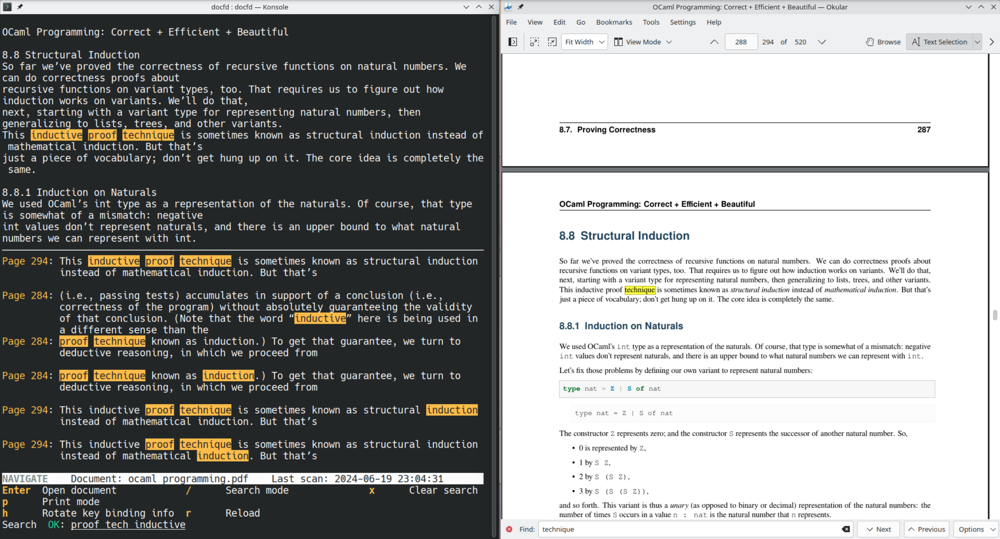

# Docfd
TUI multiline fuzzy document finder

Think interactive grep for text files, PDFs, DOCXs, etc,
but word/token based instead of regex and line based,
so you can search across lines easily.

Docfd aims to provide good UX via integration with common text editors
and PDF viewers,
so you can jump directly to a search result with a single key press.

---

Navigating repo:


---

Quick search with non-interactive mode:


---

Navigating PDF and opening it to the closest location to the selected search
result via PDF viewer integration:



## Features

- Multithreaded indexing and searching

- Multiline fuzzy search of multiple files or a single file

- Swap between multi-file view and single file view on the fly

- Content view pane that shows the snippet surrounding the search result selected

- Text editor and PDF viewer integration

<details>

#### Text editor integration

Docfd uses the text editor specified by `$VISUAL` (this is checked first) or `$EDITOR`.

Docfd opens the file at first line of search result
for the following editors:

- `nano`
- `nvim`/`vim`/`vi`
- `kak`
- `hx`
- `emacs`
- `micro`
- `jed`/`xjed`

#### PDF viewer integration

Docfd guesses the default PDF viewer based on the output
of `xdg-mime query default application/pdf`,
and invokes the viewer either directly or via flatpak
depending on where the desktop file can be first found
in the list of directories specified by `$XDG_DATA_DIRS`.

Docfd opens the file at first page of the search result
and starts a text search of the most unique word
of the matched phrase within the same page
for the following viewers:

- okular
- evince
- xreader
- atril

Docfd opens the file at first page of the search result
for the following viewers:

- mupdf

</details>

## Installation

Statically linked binaries are available via
[GitHub releases](https://github.com/darrenldl/docfd/releases).

Docfd is also packaged on:

- [opam](https://ocaml.org/p/docfd/latest)
- [AUR](https://aur.archlinux.org/packages/docfd-bin) (as `docfd-bin`) by [kseistrup](https://github.com/kseistrup)
- Nix (as `docfd`) by [chewblacka](https://github.com/chewblacka)

**Notes for packagers**: Outside of the OCaml toolchain for building (if you are
packaging from source), Docfd also requires the following
external tools at run time for full functionality:

- `pdftotext` from `poppler-utils` for PDF support
- `pandoc` for support of `.epub`, `.odt`, `.docx`, `.fb2`, `.ipynb`, `.html`, and `.htm` files
- `fzf` for file selection menu

## Launching

#### Read from piped stdin

```
command | docfd
```

Docfd uses single file view
when source of document is piped stdin.

No paths should be supplied as arguments in this case.
If any paths are specified, then stdin is ignored.

#### Scan for files

```
docfd [PATH]...
```

The list of paths can contain directories.
Each directory in the list is scanned recursively for
files with the following extensions by default:

- For multiline search mode:
    - `.txt`,
      `.md`,
      `.pdf`,
      `.epub`,
      `.odt`,
      `.docx`,
      `.fb2`,
      `.ipynb`,
      `.html`,
      `.htm`
- For single line search mode:
    - `.log`,
      `.csv`,
      `.tsv`

You can change the file extensions to use via
`--exts` and `--single-line-exts`,
or add onto the list of extensions via
`--add-exts` and `--single-line-add-exts`.

If the list `PATH`s is empty,
then Docfd defaults to scanning the
current directory `.`
unless any of the following is used:
`--paths-from`, `--glob`, `--single-line-glob`.

If exactly one file is specified
in the list of paths, then Docfd uses single file view.
Otherwise, Docfd uses multi-file view.

#### Scan for files then select with fzf

```
docfd [PATH]... ?
```

The `?` can be in any position in the path list.
If any of the path is `?`, then file selection
of the discovered files
via `fzf`
is invoked.

#### Use list of paths from file

```
docfd [PATH]... --paths-from paths.txt
```

The final list of paths used is then the concatenation
of `PATH`s and paths listed in `paths.txt`, which
has one path per line.

#### Globbing

```
docfd --glob 'relative/path/glob' --glob '/absolute/path/glob'
```

## File collection rules

<details>

- First set of files is collected based on:
    - Extensions from `--exts`, `--add-exts`, `--single-line-exts`, `--single-line-add-exts`
        - `--exts` defaults to `txt,md,pdf,epub,odt,docx,fb2,ipynb,html,htm`
        - `--single-line-exts` defaults to `log,csv,tsv`
        - `--add-exts` and `--single-line-add-exts` both default to empty
          strings
    - `PATH`s provided as command line arguments, e.g. `dir0`, `dir1`, `file0`
      in `docfd dir0 dir1 file0`
        - `PATH`s default to `.` only when none of `--paths-from`, `--glob`,
          `--single-line-glob` are specified
    - Paths specified in `FILE` from `--paths-from FILE`

- Second set of files is collected based on `--glob`

- Third set of files is collected based on `--single-line-glob`

- Directories captured by globs are not recursively scanned, i.e.
  files must be directly picked up by glob to be considered for
  second and third set of files

- Files are categorized for single line search mode and default search mode
    - Default search mode is multiline search mode, unless `--single-line` is used

- A file falls into the single line search mode category if it satisfies any of
  the following:
    - File is in `PATH`s or in `FILE` from `--paths-from FILE` and the
      extension falls into `--single-line-exts` or `--single-line-add-exts`
    - File is captured by `--single-line-glob`
    - File is captured by `--glob`, and the extension falls into
      `--single-line-exts` or `--single-line-add-exts`
- Otherwise, the file falls into the default search mode category

</details>

## Searching

The search field takes a search expression as input. A search expression is
one of:

- Search phrase, e.g. `fuzzy search`
- `?expression` (optional)
- `(expression)`
- `expression | expression` (or), e.g. `go ( left | right )`

To use literal `?`, `(`, `)` or `|`, a backslash (`\`) needs to be placed in front
of the character.

Search is asynchronous, specifically:
- Editing of search field is not blocked by search progress
- Updating/clearing the search field cancels the current search
  and starts a new search immediately

<details>

#### Optional operator handling specifics

For a phrase with optional operator, such as `?word0 word1 ...`,
the first word is grouped implicitly,
i.e. it is treated as `(?word0) word1 ...`.

#### Search phrase and search procedure

Document content and user input in the search field are tokenized/segmented
in the same way, based on:
- Contiguous alphanumeric characters
- Individual symbols
- Individual UTF-8 characters
- Spaces

A search phrase is a list of said tokens.

Search procedure is a DFS through the document index,
where the search range for a word is fixed
to a configured range surrounding the previous word (when applicable).

A token in the index matches a token in the search phrase if they fall
into one of the following cases:
- They are a case-insensitive exact match
- They are a case-insensitive substring match (token in search phrase being the substring)
- They are within the configured case-insensitive edit distance threshold

Search results are then ranked using a heuristic.

</details>

## Common controls between multi-file view and single file view

Navigation mode
- Switch to search mode
    - `/`
- Clear search field
    - `x`
- Exit Docfd
    - `Esc`, `Ctrl+C` or `Ctrl+Q`
- Print selected search result to stderr
    - `p`
- Print path of selected document to stderr
    - `Shift`+`P`

Search mode
- Search field is active in this mode
- `Enter` to confirm search expression and exit search mode

## Multi-file view


The default TUI is divided into four sections:
- Left is the list of documents which satisfy the search expression
- Top right is the content view of the document which tracks the search result selected
- Bottom right is the ranked search result list
- Bottom pane consists of:
    - Status bar
    - Key binding info
    - Search bar

Search bar consists of the search status indicator and the search field.
The search status indicator shows one of the following values:
- `OK`
    - Docfd is idle/search is done
- `...`
    - Docfd is still searching
- `ERR`
    - Docfd failed to parse the search expression in the search field

#### Controls

<details>

Docfd operates in modes, the initial mode is navigation mode.

Navigation mode
- Scroll down the document list
    - `j`
    - Down arrow
    - Page down
    - Scroll down with mouse wheel when hovering above the area
- Scroll up the document list
    - `k`
    - Up arrow
    - Page up
    - Scroll up with mouse wheel when hovering above the area
- Scroll down the search result list
    - `Shift`+`J`
    - `Shift`+Down arrow
    - `Shift`+Page down
    - Scroll down with mouse wheel when hovering above the area
- Scroll up the document list
    - `Shift`+`K`
    - `Shift`+Up arrow
    - `Shift`+Page up
    - Scroll up with mouse wheel when hovering above the area
- Open document
    - `Enter`
        - Docfd tries to use `$VISUAL` first, if that fails then Docfd tries `$EDITOR`
- Switch to single file view
    - `Tab`

</details>

## Single file view

If the specified path to Docfd is not a directory, then single file view
is used.


In this view, the TUI is divided into only three sections:
- Top is content view
- Middle is ranked search result list
- Bottom pane is the same as the one displayed in multi-file view,
  but with different key binding info

#### Controls

<details>

The controls are simplified in single file view,
namely `Shift` is optional for scrolling through search result list.

Navigation mode
- Scroll down the search result list
    - `j`
    - Down arrow
    - Page down
    - `Shift`+`J`
    - `Shift`+Down arrow
    - `Shift`+Page down
    - Scroll down with mouse wheel when hovering above the area
- Scroll up the document list
    - `k`
    - Up arrow
    - Page up
    - `Shift`+`K`
    - `Shift`+Up arrow
    - `Shift`+Page up
    - Scroll up with mouse wheel when hovering above the area
- Open document
    - `Enter`
        - Docfd tries to use `$VISUAL` first, if that fails then Docfd tries `$EDITOR`
- Switch to multi-file view
    - `Tab`

</details>

## Limitations

- File auto-reloading is not supported for PDF files,
  as PDF viewers are invoked in the background via shell.
  It is possible to support this properly
  in the ways listed below, but requires
  a lot of engineering for potentially very little gain:

    - Docfd waits for PDF viewer to terminate fully
      before resuming, but this
      prohibits viewing multiple search results
      simultaneously in different PDF viewer instances.

    - Docfd manages the launched PDF viewers completely,
      but these viewers are closed when Docfd terminates.

    - Docfd invokes the PDF viewers via shell
      so they stay open when Docfd terminates.
      Docfd instead periodically checks if they are still running
      via the PDF viewers' process IDs,
      but this requires handling forks.

    - Outside of tracking whether the PDF viewer instances
      interacting with the files are still running,
      Docfd also needs to set up file update handling
      either via `inotify` or via checking
      file modification times periodically.

## Acknowledgement

- Big thanks to [@lunacookies](https://github.com/lunacookies) for the many UI/UX discussions
  and suggestions
- Demo gifs and some screenshots are made using [vhs](https://github.com/charmbracelet/vhs).
- [ripgrep-all](https://github.com/phiresky/ripgrep-all) was used as reference
  for text extraction software choices
